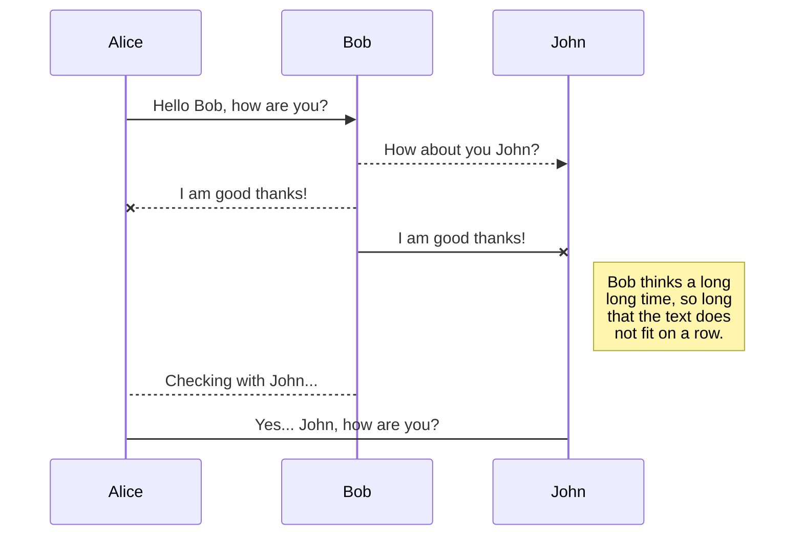
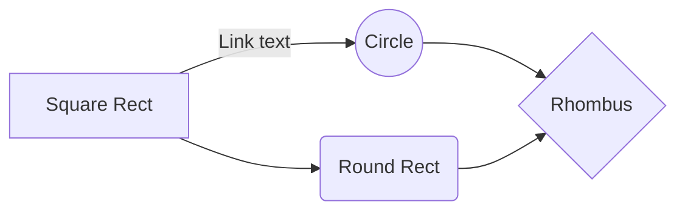

# TP5 GUI
instalar windowbuilder http://download.eclipse.org/windowbuilder/latest/
# TP7 Excepciones
```java
public class Excepcion1 extends Exception {}
public class Excepcion2 extends Excepcion1{}
public class Test1 {
	public static void main(String[] args) {
		try {
			throw new Excepcion2();
		} catch (Excepcion1 e1) {
			System.out.println("Se capturó la Excepción1");
		} catch (Excepcion2 e2) {
			System.out.println("Se capturó la Excepción2");
		}
	}
}
```
Este arroja el siguiente error: 
> Unreachable catch block for Excepcion2. It is already handled by the catch block for Excepcion1

```plantuml 
uml
(aca dibujar el uml de excepciones)
Exception2-> Exception1 -> Exception
```
```throw new Excepcion2();```  lanza la excepción y la trata el catch que está en el método ```Test1 ```. 
Cuando se lanza la excepción ```throw new Excepcion2();```, recordar que el orden de ejecución es el siguiente: 
Primero ``` catch (Excepcion1 e1)``` 
Segundo ``` catch (Excepcion2 e2)``` 
Cómo ```Exception2()``` es subclase de ```Exception1()```, entonces ``` catch (Excepcion2 e2)```   nunca va a ser alcanzada. Podemos brindar 2 soluciones:
Solución 1: 
```java
public class Excepcion1 extends Exception {}
public class Excepcion2 extends Excepcion1{}
public class Test1 {
	public static void main(String[] args) {
		try {
			throw new Excepcion2();
		} catch (Excepcion1 e1) {
			System.out.println("Se capturó la Excepción1");
		}
	}
}
```
Solución2:
```java
public class Excepcion1 extends Exception {}
public class Excepcion2 extends Excepcion1{}
public class Test1 {
	public static void main(String[] args) {
		try {
			throw new Excepcion2();
		} catch (Excepcion2 e2) {
			System.out.println("Se capturó la Excepción2");
		} catch (Excepcion1 e1) {
			System.out.println("Se capturó la Excepción1");
		}
	}
}
```

## Ejercicio 2

```java
try {
	System.out.println("Va a retornar 1");
	return 1;
} finally {
	System.out.println("Va a retornar 2");
	return 2;
}
```

Esto arroja como resultado :
```java
Va a retornar 1
Va a retornar 2
2
```
Siempre se ejecuta el bloque ``` finaly ```

## Ejercicio 3
```java
try {
	System.out.println("Primer try");
	try {
		throw new Exception();
	} finally {
		System.out.println("Finally del 2º try");
	}
} catch (Exception e) {
	System.out.println("Se capturó la Excepción ex del 1º Primer try");
} finally {
	System.out.println("Finally del 1º try");
}
```
Esto arroja como resultado:

```java
Test3
Primer try
Finally del 2º try
Se capturó la Excepción ex del 1º Primer try
Finally del 1º try
```
## Ejercicio 4
Recordar que cuando hago un throw de una excepción, puedo que arrojar 
1. excepciones que están definidas en el encabezado de la super clase
2. o subclases de las excepciones que están definidas en el encabezado de la super clase
Esto es posible
```java
class Partido {
	void jugada() throws EquipoIncompleto, FaltaException {}
}
public class Encuentro extends Partido implements Tormenta {
	void jugada() throws ManoException {}
}
public class ManoException extends FaltaException{}
```
Observar que como ```ManoException()``` es subclase de ```FaltaException()```, entonces puedo hacer 
```java 
	void jugada() throws ManoException {}
```
Pero no sería posible lo siguiente:

```java
class Partido {
	void jugada() throws EquipoIncompleto, FaltaException {}
}
public class Encuentro extends Partido implements Tormenta {
	void jugada() throws LluviaException {}
}
public class LluviaException extends ClimaException {}
public class ClimaException extends Exception{}
```
## Ejercicio 5
 java.lang.ArrayIndexOutOfBoundsException:
 java.lang.NumberFormatException

---------------------

# Anotaciones : TP8

# Threads : TP9
**Ejercicio2:** 
el método `run()` bloquea `System.out` con la palabra clave `synchronized`. Define un bloque entre `{` y  `}` y hasta que no termine de ejecutarse el bloque, no libera `System.out`
Existen 2 tipos de `lock`
1. `lock` definido sobre un objeto
```java
	public class SynchronizedCounter 
	{ 
		private int c = 0;
		public synchronized void increment() { c++; }
		public synchronized void decrement() { c--; } 
		public synchronized int value() { return c; } 
		public int sinBloquear() { hace_algo() }
	}
```
Si se invoca algún `synchronized`, se bloquean los demás definidos como `synchronized`
Ejemplo: 

El objeto `synchronizedCounterObject`  invoca `increment`

**Mientras se ejecuta `increment()`**,     

1. el objeto `synchronizedCounterObject`  **puede invocar** `sinBloquear()`, pero **no puede invocar** a `decrement()` ni a `value()`
2. el método `increment()` puede hacer uso de todos los métodos de `SynchronizedCounter`, es decir de `increment()`, `decrement()`, `value()` y `sinBloquear()`

Tipos de **lock**
-  `lock` definido sobre un método
````java
	public synchronized int f() {}
````
- `lock` definido sobre un objeto
````java
	synchronized (System.out) {} 
````


# Welcome to StackEdit!

Hi! I'm your first Markdown file in **StackEdit**. If you want to learn about StackEdit, you can read me. If you want to play with Markdown, you can edit me. Once you have finished with me, you can create new files by opening the **file explorer** on the left corner of the navigation bar.


# Files

StackEdit stores your files in your browser, which means all your files are automatically saved locally and are accessible **offline!**

## Create files and folders

The file explorer is accessible using the button in left corner of the navigation bar. You can create a new file by clicking the **New file** button in the file explorer. You can also create folders by clicking the **New folder** button.

## Switch to another file

All your files are listed in the file explorer. You can switch from one to another by clicking a file in the list.

## Rename a file

You can rename the current file by clicking the file name in the navigation bar or by clicking the **Rename** button in the file explorer.

## Delete a file

You can delete the current file by clicking the **Remove** button in the file explorer. The file will be moved into the **Trash** folder and automatically deleted after 7 days of inactivity.

## Export a file

You can export the current file by clicking **Export to disk** in the menu. You can choose to export the file as plain Markdown, as HTML using a Handlebars template or as a PDF.


# Synchronization

Synchronization is one of the biggest features of StackEdit. It enables you to synchronize any file in your workspace with other files stored in your **Google Drive**, your **Dropbox** and your **GitHub** accounts. This allows you to keep writing on other devices, collaborate with people you share the file with, integrate easily into your workflow... The synchronization mechanism takes place every minute in the background, downloading, merging, and uploading file modifications.

There are two types of synchronization and they can complement each other:

- The workspace synchronization will sync all your files, folders and settings automatically. This will allow you to fetch your workspace on any other device.
	> To start syncing your workspace, just sign in with Google in the menu.

- The file synchronization will keep one file of the workspace synced with one or multiple files in **Google Drive**, **Dropbox** or **GitHub**.
	> Before starting to sync files, you must link an account in the **Synchronize** sub-menu.

## Open a file

You can open a file from **Google Drive**, **Dropbox** or **GitHub** by opening the **Synchronize** sub-menu and clicking **Open from**. Once opened in the workspace, any modification in the file will be automatically synced.

## Save a file

You can save any file of the workspace to **Google Drive**, **Dropbox** or **GitHub** by opening the **Synchronize** sub-menu and clicking **Save on**. Even if a file in the workspace is already synced, you can save it to another location. StackEdit can sync one file with multiple locations and accounts.

## Synchronize a file

Once your file is linked to a synchronized location, StackEdit will periodically synchronize it by downloading/uploading any modification. A merge will be performed if necessary and conflicts will be resolved.

If you just have modified your file and you want to force syncing, click the **Synchronize now** button in the navigation bar.

> **Note:** The **Synchronize now** button is disabled if you have no file to synchronize.

## Manage file synchronization

Since one file can be synced with multiple locations, you can list and manage synchronized locations by clicking **File synchronization** in the **Synchronize** sub-menu. This allows you to list and remove synchronized locations that are linked to your file.


# Publication

Publishing in StackEdit makes it simple for you to publish online your files. Once you're happy with a file, you can publish it to different hosting platforms like **Blogger**, **Dropbox**, **Gist**, **GitHub**, **Google Drive**, **WordPress** and **Zendesk**. With [Handlebars templates](http://handlebarsjs.com/), you have full control over what you export.

> Before starting to publish, you must link an account in the **Publish** sub-menu.

## Publish a File

You can publish your file by opening the **Publish** sub-menu and by clicking **Publish to**. For some locations, you can choose between the following formats:

- Markdown: publish the Markdown text on a website that can interpret it (**GitHub** for instance),
- HTML: publish the file converted to HTML via a Handlebars template (on a blog for example).

## Update a publication

After publishing, StackEdit keeps your file linked to that publication which makes it easy for you to re-publish it. Once you have modified your file and you want to update your publication, click on the **Publish now** button in the navigation bar.

> **Note:** The **Publish now** button is disabled if your file has not been published yet.

## Manage file publication

Since one file can be published to multiple locations, you can list and manage publish locations by clicking **File publication** in the **Publish** sub-menu. This allows you to list and remove publication locations that are linked to your file.


# Markdown extensions

StackEdit extends the standard Markdown syntax by adding extra **Markdown extensions**, providing you with some nice features.

> **ProTip:** You can disable any **Markdown extension** in the **File properties** dialog.


## SmartyPants

SmartyPants converts ASCII punctuation characters into "smart" typographic punctuation HTML entities. For example:

|                |ASCII                          |HTML                         |
|----------------|-------------------------------|-----------------------------|
|Single backticks|`'Isn't this fun?'`            |'Isn't this fun?'            |
|Quotes          |`"Isn't this fun?"`            |"Isn't this fun?"            |
|Dashes          |`-- is en-dash, --- is em-dash`|-- is en-dash, --- is em-dash|


## KaTeX

You can render LaTeX mathematical expressions using [KaTeX](https://khan.github.io/KaTeX/):

The *Gamma function* satisfying $\Gamma(n) = (n-1)!\quad\forall n\in\mathbb N$ is via the Euler integral

$$
\Gamma(z) = \int_0^\infty t^{z-1}e^{-t}dt\,.
$$

> You can find more information about **LaTeX** mathematical expressions [here](http://meta.math.stackexchange.com/questions/5020/mathjax-basic-tutorial-and-quick-reference).


## UML diagrams

You can render UML diagrams using [Mermaid](https://mermaidjs.github.io/). For example, this will produce a sequence diagram:



And this will produce a flow chart:


